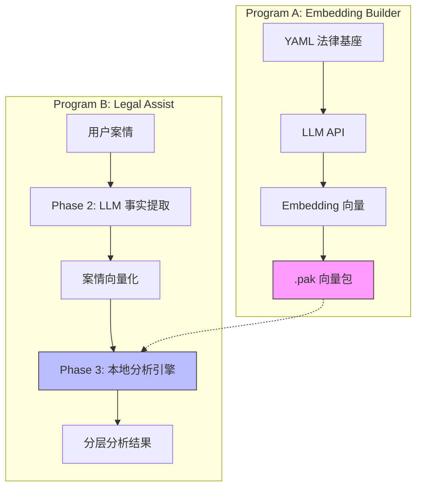
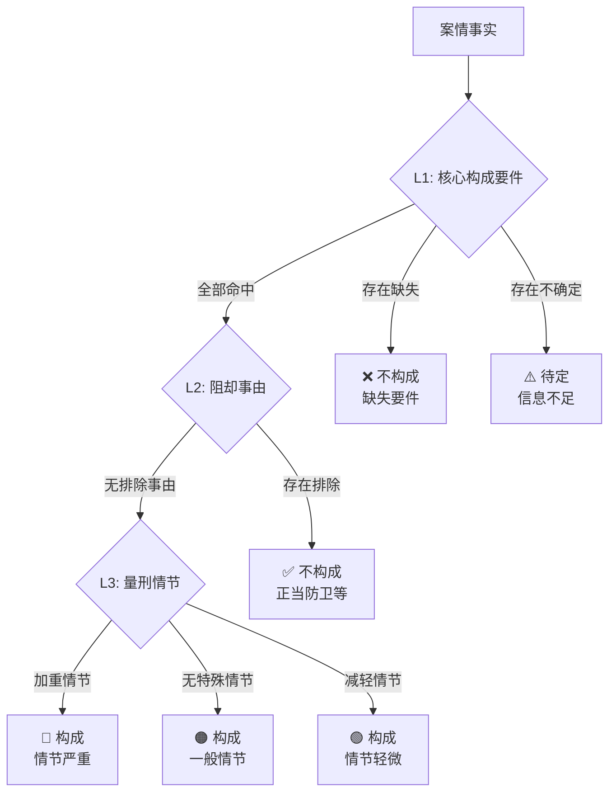

# Legal Assist - 法律案件智能分析引擎

<p align="center">
  
</p>

<p align="center">
  <strong>Alpha 0.2.0</strong> | 基于语义嵌入的刑事案件定性与量刑分析系统
</p>

---

## 项目概述

Legal Assist 是一款创新的法律科技工具，采用**语义嵌入（Semantic Embedding）+ 本地确定性推理**的混合架构，实现对刑事案件的智能化分析。

### 核心优势

| 特性 | 说明 |
|------|------|
| 🔒 **确定性** | Phase 3 完全离线运行，100% 可解释 |
| 🚀 **高效** | 向量相似度计算毫秒级响应 |
| 📦 **数据驱动** | 修改 YAML 即可扩展法律覆盖范围 |
| 🔄 **动态更新** | 重建 Embedding 包即可更新语义匹配 |

---

## 系统架构



---

## 技术原理

### 一、向量空间模型

法律要素和案情事实被映射到同一高维向量空间（1024 维），通过**余弦相似度**判断语义匹配程度。

#### 余弦相似度公式

$$
\text{similarity}(\vec{A}, \vec{B}) = \frac{\vec{A} \cdot \vec{B}}{\|\vec{A}\| \times \|\vec{B}\|} = \frac{\sum_{i=1}^{n} A_i B_i}{\sqrt{\sum_{i=1}^{n} A_i^2} \times \sqrt{\sum_{i=1}^{n} B_i^2}}
$$

其中：

- $\vec{A}$：法律标准 Slot 的 Embedding 向量（来自 `.pak` 文件）
- $\vec{B}$：案情提取事实的 Embedding 向量（实时计算）
- 输出范围：$[-1, 1]$，通常在 $[0, 1]$

#### 匹配状态判定

```
相似度 ≥ threshold + margin  →  命中 (Hit)
相似度 ≤ threshold - margin  →  缺失 (Missing)
其他情况                      →  不确定 (Uncertain)
```

默认参数：`threshold = 0.45`, `margin = 0.05`

---

### 二、自适应三层分析框架

系统采用**递进式深钻**策略，自动执行 L1→L2→L3 全量分析：



#### 各层级职责

| 层级 | 名称 | 法律术语 | 职责 |
|------|------|----------|------|
| **L1** | 核心构成要件 | 定性 | 判断是否满足犯罪构成四要件 |
| **L2** | 阻却事由 | 过滤 | 检查正当防卫、紧急避险等排除情形 |
| **L3** | 量刑情节 | 定量 | 识别加重/减轻情节，确定量刑等级 |

---

### 三、数据模型设计

#### 分析结果结构

```dart
TieredAnalysisResult
├── crimeAnalyses: List<TieredCrimeAnalysis>
│   ├── coreElements: CoreElementsResult     // L1 结果
│   │   ├── hitSlots: [...]
│   │   ├── missingSlots: [...]
│   │   └── uncertainSlots: [...]
│   ├── exclusionAnalysis?: ExclusionResult  // L2 结果
│   │   └── hitExclusions: [...]
│   ├── sentencingAnalysis?: SentencingResult // L3 结果
│   │   ├── aggravatingFactors: [...]
│   │   └── mitigatingFactors: [...]
│   └── finalConclusion: CrimeConclusion
└── metadata: {版本, 阈值, 时间戳}
```

#### 结论枚举

| 枚举值 | 含义 | 触发条件 |
|--------|------|----------|
| `notConstitutedMissingElements` | 不构成（缺失） | L1 缺失必要要件 |
| `notConstitutedExcluded` | 不构成（排除） | L2 命中阻却事由 |
| `constitutedMinor` | 构成（轻微） | L3 仅有减轻情节 |
| `constitutedNormal` | 构成（一般） | L3 无特殊情节 |
| `constitutedSerious` | 构成（严重） | L3 命中"情节严重" |
| `constitutedVerySevere` | 构成（特别严重） | L3 命中"情节特别严重" |
| `uncertain` | 待定 | L1 存在不确定要件 |

---

### 四、Embedding 批量计算优化

Phase 2 的事实提取后，系统需要为每个提取到的要素计算 Embedding 向量。

#### 优化前后对比

```
优化前: N 次串行请求 (N = 提取事实数)
       Request₁ → Response₁ → Request₂ → Response₂ → ...

优化后: 1 次批量请求
       [Text₁, Text₂, ..., Textₙ] → [Vec₁, Vec₂, ..., Vecₙ]
```

#### API 调用统计

| 阶段 | API 类型 | 调用次数 |
|------|----------|----------|
| Phase 2 事实提取 | Chat Completion | 1 次 |
| Phase 2 向量计算 | Embedding Batch | **1 次** |
| Phase 3 本地分析 | 无 | **0 次** |

---

### 五、YAML 基座结构

法律知识以 YAML 格式存储，支持动态扩展：

```yaml
slots:
  - slot_id: "S001"
    slot_name: "行为主体"
    analysis_level: 1           # 参与 L1 分析
    role: "qualification"       # 定性要件
    required: true
    semantic_scope: "具有刑事责任能力的自然人或单位..."

  - slot_id: "S201"
    slot_name: "情节严重"
    analysis_level: 3           # 参与 L3 分析
    role: "sentencing"          # 量刑情节
    sentencing_type: "aggravating"  # 加重因素

crimes:
  - crime_id: "C341_1"
    crime_name: "危害珍贵、濒危野生动物罪"
    required_slots: ["S001", "S002", "S003"]  # L1 必需
    exclusion_slots: ["S101", "S102"]         # L2 排除
    optional_slots: ["S201", "S202", "S203"]  # L3 量刑
```

---

## 项目结构

```
Embedding_Legal_Engine/
├── shared/                    # 共享数据模型库
│   └── lib/models/
│       ├── slot_model.dart
│       ├── crime_model.dart
│       ├── tiered_analysis_model.dart  # ★ 分层结果模型
│       └── ...
│
├── embedding_builder_tool/    # Program A: Embedding 构建工具
│   └── lib/
│       ├── services/llm_service.dart
│       └── screens/...
│
├── legal_assist/              # Program B: 案件分析主程序
│   └── lib/
│       ├── engines/
│       │   └── local_analysis_engine.dart  # ★ 分层分析引擎
│       ├── services/
│       │   └── llm_extraction_service.dart # ★ Batch Embedding
│       ├── widgets/
│       │   └── mind_map_view.dart          # ★ 思维导图组件
│       └── screens/...
│
└── assets/
    ├── legal_base.yaml        # 法律基座
    └── *.pak                  # Embedding 向量包
```

---

## 版本历史

| 版本 | 日期 | 主要更新 |
|------|------|----------|
| Alpha 0.2.0 | 2026-01-11 | 自适应分层分析、思维导图可视化、Batch Embedding |
| Alpha 0.1.0 | 2026-01-09 | 初版发布 |

---

## 许可证

本项目采用 Apache License 2.0 协议开源。详情请参阅 [LICENSE](LICENSE) 文件。

Copyright 2026 Legal Assist Authors
