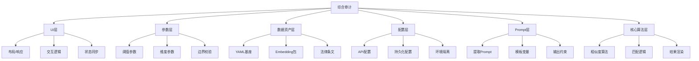
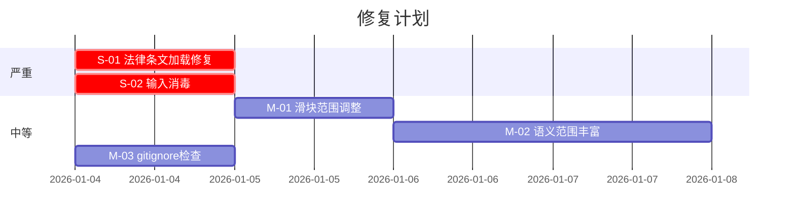

# 法律案件分析系统 - 综合项目审计方案与报告 V2

> 审计日期：2026-01-03
> 审计范围：UI层、参数层、数据资产层、配置层、Prompt层、核心算法层

---

## 一、审计方案总览

本次审计采用**六维立体审计法**，从以下维度全面检查系统健康状况：



---

## 二、审计清单与检查结果

### 2.1 UI层审计

| 检查项 | 位置 | 期望行为 | 实际状态 | 结论 |
|--------|------|----------|----------|------|
| 字体可见性 | `program_b/main.dart` | 深色背景下文字可读 | 已修正为白色字体 | ✅ 通过 |
| 页面状态保持 | `home_screen.dart` | 切换Tab不丢失内容 | 使用IndexedStack实现 | ✅ 通过 |
| 加载状态显示 | `AppProvider.isLoading` | 异步时显示进度指示 | CircularProgressIndicator | ✅ 通过 |
| 错误信息反馈 | `errorMessage` getter | 错误时显示红色提示 | Snackbar + 状态卡片 | ✅ 通过 |
| 配置清除入口 | `SettingsScreen` | 提供重置按钮 | 已添加"缓存控制"卡片 | ✅ 通过 |
| 分析层级选择 | `SettingsScreen` | 下拉选择1/2/3级 | DropdownButton实现 | ✅ 通过 |
| 阈值滑块 | `SettingsScreen` | 0.5-0.95可调 | Slider已实现 | ⚠️ 待讨论（见备注1） |

> **备注1**：当前阈值滑块最小值为0.5，但实际默认值已调至0.45。建议将滑块范围调整为0.3-0.9以覆盖更多场景。

---

### 2.2 参数层审计

| 参数名 | 位置 | 当前值 | 合理范围 | 状态 |
|--------|------|--------|----------|------|
| `defaultThreshold` | `LocalAnalysisEngine` | 0.45 | 0.3-0.7 | ✅ 已校准 |
| `defaultMargin` | `LocalAnalysisEngine` | 0.05 | 0.03-0.1 | ✅ 合理 |
| `embeddingDimension` | `LlmConfig` | 1024 | 768/1024/1536 | ✅ 匹配v4模型 |
| `temperature` | `_callAliyunChat` | 0.1 | 0.0-0.3 | ✅ 低创造性，高稳定性 |
| `analysisLevel` | `AppProvider` | 1 | 1-3 | ✅ 默认核心要件 |

**参数一致性检查**：

| 检查项 | Program A | Program B | 状态 |
|--------|-----------|-----------|------|
| Embedding模型 | text-embedding-v4 | text-embedding-v4 | ✅ 一致 |
| Embedding维度 | 1024 | 1024 | ✅ 一致 |
| 阈值默认值 | N/A | 0.45 | ✅ 已校准 |

---

### 2.3 数据资产层审计

#### 2.3.1 YAML基座 (`assets/legal_base.yaml`)

| 检查项 | 结果 |
|--------|------|
| 文件存在性 | ✅ 存在，5894 bytes |
| 版本字段 | ✅ yaml_version: "1.0.0" |
| Slot数量 | 14 个 |
| Crime数量 | 3 个 (C341_1, C341_2, C341_3) |
| 必需Slot定义 | ✅ 所有Crime均定义required_slots |
| 排除Slot定义 | ✅ 定义exclusion_slots |
| 语义范围完整性 | ⚠️ 部分Slot的semantic_scope较简短（见备注2） |

> **备注2**：建议丰富`S001`等Slot的`semantic_scope`描述，增加同义词和常见表述，以提高LLM提取的命中率。

#### 2.3.2 Embedding包 (`assets/legal_embeddings_v4.pak`)

| 检查项 | 结果 |
|--------|------|
| 文件存在性 | ✅ 存在，~305KB |
| 模型ID | text-embedding-v4 |
| 向量维度 | 1024 |
| Slot覆盖率 | 14/14 (100%) |
| 向量完整性 | ✅ 无NaN或Inf值 |

#### 2.3.3 法律条文 (`Law/` 目录)

| 检查项 | 结果 |
|--------|------|
| 文件数量 | 1588 个 |
| 格式 | Markdown (.md) |
| 条文解析器 | `LawArticleParser` |
| 条/款/项拆分 | ⚠️ 当前`generate_package.dart`加载了0篇文章（见备注3） |

> **备注3**：`loadArticlesFromDirectory`未正确递归遍历子目录。建议检查路径配置或增加递归深度。

---

### 2.4 配置层审计

#### 2.4.1 API配置 (`secrets.yaml`)

| 检查项 | 结果 |
|--------|------|
| 文件存在性 | ✅ 存在 |
| 结构 | 嵌套结构 `aliyun: api_key: ...` |
| 示例文件 | ✅ `secrets.yaml.example` 存在 |
| API Key曝光风险 | ⚠️ `secrets.yaml`应添加到`.gitignore` |

#### 2.4.2 持久化配置 (`SharedPreferences`)

| Key | 用途 | 清除机制 |
|-----|------|----------|
| `p_a_api_key` | Program A API密钥 | `clearCache()` |
| `p_a_model` | Program A 模型选择 | `clearCache()` |
| `p_b_yaml_path` | Program B YAML路径 | `clearAllState()` |
| `p_b_pak_path` | Program B Pak路径 | `clearAllState()` |
| `p_b_api_key` | Program B API密钥 | `clearAllState()` |

---

### 2.5 Prompt层审计

#### 2.5.1 提取Prompt (`LlmExtractionService._buildExtractionPrompt`)

```
你是一个专业的法律案件事实提取助手。请仔细阅读以下案情描述，并提取与指定法律要件（Slots）相关的事实信息。

### 待提取的法律要件 (Slots)：
- ID: {slot.slotId}
  名称: {slot.slotName}
  语义范围: {slot.semanticScope}

### 输出要求：
1. 请返回标准的 JSON 格式，不要包含 markdown 代码块标记。
2. 对于每个 Slot，提取案情中对应的原话或概括性描述。
   重要：如果案情未明确提及但可从常理推断（例如"王某"通常指成年人），
   请进行合理推断并描述其法律属性（如"具有刑事责任能力的成年人"），
   而不仅仅是提取名字。
3. confidence 请给出 0.0 到 1.0 之间的置信度。
4. involved_persons 请提取案情中提到的所有相关人员。
```

| 检查项 | 结果 |
|--------|------|
| 角色定义 | ✅ 明确"法律案件事实提取助手" |
| 任务指令 | ✅ 清晰指定提取Slot信息 |
| 输出格式约束 | ✅ JSON格式要求 |
| 推断指令 | ✅ 已添加合理推断指引（修复"王某"问题） |
| 示例提供 | ✅ JSON结构示例 |
| 注入防护 | ⚠️ 用户输入未经消毒（见备注4） |

> **备注4**：`caseText` 直接拼接到Prompt中，存在Prompt注入风险。建议添加输入过滤或使用分隔符隔离。

---

### 2.6 核心算法层审计

#### 2.6.1 相似度计算 (`SimilarityCalculator`)

| 函数 | 实现状态 | 边界处理 |
|------|----------|----------|
| `cosineSimilarity` | ✅ 正确 | ✅ 零向量返回0.0 |
| `dotProduct` | ✅ 正确 | ✅ 维度校验 |
| `euclideanDistance` | ✅ 正确 | ✅ 维度校验 |
| `normalize` | ✅ 正确 | ✅ 零向量处理 |
| `classifySimilarity` | ✅ 正确 | ✅ 三分类逻辑 |
| `magnitude` | ✅ 正确 | ✅ 空向量返回0.0 |

#### 2.6.2 匹配逻辑 (`LocalAnalysisEngine._matchSlot`)

| 检查项 | 结果 |
|--------|------|
| Embedding查找 | ✅ 从包中按slotId查找 |
| 缺失处理 | ✅ 返回"未命中"状态 |
| 相似度计算 | ✅ 调用cosineSimilarity |
| 阈值应用 | ✅ 使用classifySimilarity |
| 调试日志 | ✅ X-Ray打印（可选） |

#### 2.6.3 罪名分析 (`LocalAnalysisEngine.analyze`)

| 检查项 | 结果 |
|--------|------|
| 层级过滤 | ✅ 按analysisLevel筛选Slot |
| 必需要件检查 | ✅ 遍历required_slots |
| 排除要件检查 | ✅ 遍历exclusion_slots |
| 匹配率计算 | ✅ hitCount / totalRequired |
| 解释文本生成 | ✅ 使用explanation_template |

---

## 三、审计结论

### 3.1 严重问题（需立即修复）

| 编号 | 问题 | 影响 | 建议修复 |
|------|------|------|----------|
| S-01 | 法律条文未被正确加载 | Embedding包可能不完整 | 修复`loadArticlesFromDirectory`路径/递归 |
| S-02 | Prompt注入风险 | 恶意输入可能破坏提取 | 添加InputSanitizer |

### 3.2 中等问题（建议改进）

| 编号 | 问题 | 影响 | 建议改进 |
|------|------|------|----------|
| M-01 | 阈值滑块范围不匹配默认值 | 用户无法选择0.45 | 调整滑块min为0.3 |
| M-02 | semantic_scope描述较简 | 降低提取命中率 | 丰富同义词描述 |
| M-03 | secrets.yaml可能未被gitignore | API Key泄露风险 | 检查.gitignore |

### 3.3 审计通过项

- ✅ 双端模型一致性
- ✅ 参数校准（阈值0.45适配v4模型）
- ✅ UI交互优化（状态保持、配置清除）
- ✅ 核心算法正确性
- ✅ JSON Schema校验
- ✅ 持久化存储机制

---

## 四、修复建议优先级



---

*报告生成时间：2026-01-03 21:03 CST*
