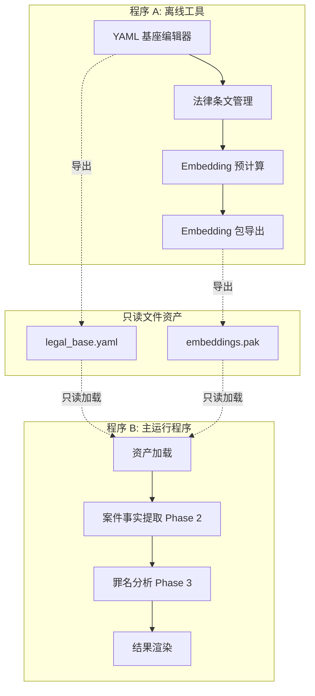

# 法律案件分析系统 - 实施计划

## 系统概述

本系统是一个**法律案件分析系统**，核心原则：

- LLM 只是翻译器，不是裁决者
- 全过程可解释、可回溯、可复核
- 确定性算法完成罪名分析

---

## 整体架构



> [!IMPORTANT]
> 两个程序之间**只允许通过只读文件资产交互**，禁止共享运行态逻辑或内存状态。

---

## 项目结构设计

```
Embedding_Legal_Engine/
├── program_a/                          # 程序 A: 离线工具
│   ├── lib/
│   │   ├── main.dart
│   │   ├── screens/
│   │   │   ├── yaml_editor_screen.dart
│   │   │   ├── law_article_screen.dart
│   │   │   └── embedding_export_screen.dart
│   │   ├── services/
│   │   │   ├── yaml_service.dart
│   │   │   ├── llm_service.dart
│   │   │   └── embedding_service.dart
│   │   ├── models/
│   │   │   └── (共享模型引用)
│   │   └── widgets/
│   ├── pubspec.yaml
│   └── windows/
│
├── program_b/                          # 程序 B: 主运行程序
│   ├── lib/
│   │   ├── main.dart
│   │   ├── screens/
│   │   │   ├── case_input_screen.dart
│   │   │   ├── analysis_result_screen.dart
│   │   │   └── explanation_screen.dart
│   │   ├── services/
│   │   │   ├── asset_loader_service.dart
│   │   │   ├── llm_extraction_service.dart
│   │   │   └── crime_analysis_service.dart
│   │   ├── models/
│   │   │   └── (共享模型引用)
│   │   ├── engines/
│   │   │   └── local_analysis_engine.dart
│   │   └── widgets/
│   ├── pubspec.yaml
│   └── windows/
│
├── shared/                             # 共享数据结构（仅类型定义）
│   ├── lib/
│   │   ├── models/
│   │   │   ├── yaml_base_model.dart
│   │   │   ├── slot_model.dart
│   │   │   ├── crime_model.dart
│   │   │   └── embedding_package_model.dart
│   │   ├── schemas/
│   │   │   ├── yaml_schema.dart
│   │   │   ├── embedding_schema.dart
│   │   │   └── extraction_schema.dart
│   │   └── validators/
│   │       └── json_schema_validator.dart
│   └── pubspec.yaml
│
├── assets/                             # 只读资产目录
│   ├── legal_base.yaml                 # YAML 基座文件
│   ├── law_articles/                   # 法律条文（按条/款/项拆分）
│   │   ├── criminal_law/
│   │   │   ├── article_001_clause_01.txt
│   │   │   └── ...
│   │   └── ...
│   └── embeddings/                     # Embedding 包
│       └── embeddings_v1.pak
│
└── docs/                               # 文档
    └── architecture.md
```

---

## User Review Required

> [!CAUTION]
> **LLM API 配置需要用户提供**
>
> - 需要确认使用哪个 Embedding 模型（如 OpenAI text-embedding-3-small, 阿里 text-embedding-v3 等）
> - 需要提供 API Key 和 Endpoint

> [!WARNING]
> **法律条文数据来源**
>
> - 用户需要提供法律条文数据库或指定数据来源
> - 条文需按"条/款/项"格式预先拆分

> [!IMPORTANT]
> **YAML 基座初始内容**
>
> - 是否需要我创建一个示例 YAML 模板作为起点？
> - 需要支持哪些法律体系类型（刑事/行政/民事）？

---

## Proposed Changes

### Shared Package（共享数据结构）

#### [NEW] [yaml_base_model.dart](file:///d:/CodingProjects/DartProject/Embedding_Legal_Engine/shared/lib/models/yaml_base_model.dart)

YAML 基座数据模型，包含：

- `YamlBase`: 全局信息（版本、法律体系、分析层级）
- `Slot`: 构成要素定义（slot_id, slot_name, analysis_level, required, role, semantic_scope）
- `Crime`: 罪名定义（crime_id, crime_name, required_slots, optional_slots, exclusion_slots, explanation_template）

#### [NEW] [embedding_package_model.dart](file:///d:/CodingProjects/DartProject/Embedding_Legal_Engine/shared/lib/models/embedding_package_model.dart)

Embedding 包数据模型：

- `EmbeddingPackage`: 包含 embedding_model_id, embedding_version
- `SlotEmbedding`: 包含 slot_id, embedding_vector（List<double>）

#### [NEW] [json_schema_validator.dart](file:///d:/CodingProjects/DartProject/Embedding_Legal_Engine/shared/lib/validators/json_schema_validator.dart)

JSON Schema 校验器：

- 验证 LLM 输出格式
- 验证 Embedding 包格式
- 验证案件提取结果格式

---

### Program A（离线工具）

#### [NEW] [yaml_editor_screen.dart](file:///d:/CodingProjects/DartProject/Embedding_Legal_Engine/program_a/lib/screens/yaml_editor_screen.dart)

YAML 编辑界面：

- 全局信息编辑（版本、法律体系类型、分析层级）
- Slot 列表管理（增删改查）
- Crime 列表管理（增删改查）
- 实时 YAML 预览

#### [NEW] [embedding_service.dart](file:///d:/CodingProjects/DartProject/Embedding_Legal_Engine/program_a/lib/services/embedding_service.dart)

Embedding 预计算服务：

```dart
class EmbeddingService {
  /// 严格按照流程执行 embedding 预计算
  Future<EmbeddingPackage> computeEmbeddings({
    required YamlBase yamlBase,
    required List<LawArticle> articles,
  }) async {
    // 1. 读取 yaml（已传入）
    // 2. 遍历法律条文（一次一个文件）
    // 3. 根据 slot 定义组装 prompt
    // 4. 调用 LLM API
    // 5. 解析 JSON 输出：slot_id → embedding
    // 6. 执行 JSON schema 校验
    // 7. 写入本地 embedding 数据
    // 8. 导出 embedding 包
  }
}
```

> [!IMPORTANT]
> 程序 A **禁止**：解析案件事实、进行罪名分析、调用任何裁决或推理逻辑

---

### Program B（主运行程序）

#### [NEW] [case_input_screen.dart](file:///d:/CodingProjects/DartProject/Embedding_Legal_Engine/program_b/lib/screens/case_input_screen.dart)

案件输入界面：

- 自然语言案情输入
- 提交按钮触发 Phase 2 提取

#### [NEW] [llm_extraction_service.dart](file:///d:/CodingProjects/DartProject/Embedding_Legal_Engine/program_b/lib/services/llm_extraction_service.dart)

案件事实提取服务（Phase 2）：

```dart
class LlmExtractionService {
  /// 单次调用 LLM 提取案件事实
  Future<CaseExtraction> extractFacts({
    required String caseText,
    required List<Slot> slots,
  }) async {
    // 1. 按 yaml 中 slot 列表组装 prompt
    // 2. 单次调用 LLM API（禁止多次调用）
    // 3. LLM 输出 JSON：
    //    - slot_id → slot_text
    //    - slot_id → slot_embedding
    //    - 可选：涉案人员信息
    // 4. slot_embedding 必须由 slot_text 派生
    // 5. JSON schema 校验
  }
}
```

> [!CAUTION]
> **禁止对同一案件进行多次事实提取调用**

#### [NEW] [local_analysis_engine.dart](file:///d:/CodingProjects/DartProject/Embedding_Legal_Engine/program_b/lib/engines/local_analysis_engine.dart)

罪名分析引擎（Phase 3 - **100% 本地**）：

```dart
class LocalAnalysisEngine {
  /// 纯本地、确定性、白箱罪名分析
  AnalysisResult analyze({
    required YamlBase yamlBase,
    required EmbeddingPackage legalEmbeddings,
    required CaseExtraction caseExtraction,
  }) {
    // 1. 根据 analysis_level 选择参与分析的 slot
    // 2. 对每个候选罪名执行：
    //    - required_slots 是否齐全
    //    - exclusion_slots 是否命中
    //    - slot_embedding 相似度计算
    // 3. 相似度算法：cosine / dot + 固定阈值
    // 4. 输出：命中要件、缺失要件、不确定要件
  }
  
  /// Cosine 相似度计算
  double cosineSimilarity(List<double> a, List<double> b) {
    // 确定性本地算法
  }
}
```

> [!CAUTION]
> Phase 3 **禁止**：
>
> - 调用 LLM
> - 生成新的 embedding
> - 修改 yaml
>
> 解释文本只能来自 yaml 的 `explanation_template`

---

## YAML 基座示例结构

```yaml
# legal_base.yaml
yaml_version: "1.0.0"
legal_system_type: "criminal"  # criminal / administrative / civil
analysis_levels:
  - level: 1
    name: "核心要件"
  - level: 2
    name: "辅助要件"
  - level: 3
    name: "情节要素"

slots:
  - slot_id: "S001"
    slot_name: "主体适格性"
    analysis_level: 1
    required: true
    role: "定性"
    semantic_scope: "行为主体是否具备刑事责任能力"
  
  - slot_id: "S002"
    slot_name: "主观故意"
    analysis_level: 1
    required: true
    role: "定性"
    semantic_scope: "行为人是否存在犯罪故意或过失"
  
  - slot_id: "S003"
    slot_name: "正当防卫"
    analysis_level: 2
    required: false
    role: "排除"
    semantic_scope: "是否构成正当防卫或紧急避险"

crimes:
  - crime_id: "C001"
    crime_name: "故意杀人罪"
    applicable_case_type: "criminal"
    required_slots: ["S001", "S002"]
    optional_slots: []
    exclusion_slots: ["S003"]
    explanation_template: |
      根据《刑法》第二百三十二条，故意杀人的，处死刑、无期徒刑或者十年以上有期徒刑。
      本案中，{slot_analysis}。
```

---

## Verification Plan

### 自动化测试

```bash
# 1. 运行 shared 包单元测试
cd shared
flutter test

# 2. 运行 Program A 单元测试
cd ../program_a
flutter test

# 3. 运行 Program B 单元测试
cd ../program_b
flutter test
```

测试覆盖：

- [ ] YAML 解析与序列化
- [ ] JSON Schema 校验
- [ ] Cosine 相似度计算
- [ ] Slot 匹配逻辑
- [ ] Embedding 包读写

### 手动验证

1. **程序 A 验证**：
   - 启动程序 A Windows GUI
   - 创建/编辑 YAML 基座
   - 导入测试法律条文
   - 执行 Embedding 预计算
   - 验证导出的 `.pak` 文件格式

2. **程序 B 验证**：
   - 启动程序 B Windows GUI
   - 加载 YAML 基座和 Embedding 包
   - 输入测试案件文本
   - 验证 Phase 2 提取结果
   - 验证 Phase 3 分析结果的可解释性

3. **隔离性验证**：
   - 确认程序 A 无法访问 Phase 3 逻辑
   - 确认程序 B 的 Phase 3 不调用任何 LLM

---

## 待用户确认事项

1. **LLM API 配置**：使用哪个 Embedding 模型？需要 API Key 和 Endpoint。

2. **法律条文来源**：是否有现成的条文数据库？还是需要我创建示例数据？

3. **初始 YAML 模板**：是否需要预置示例 Slot 和 Crime 定义？

4. **UI 设计偏好**：是否有特定的 UI 风格要求？（如深色主题、特定配色等）

5. **Embedding 维度**：确认使用的 Embedding 模型维度（如 1536、768 等）
